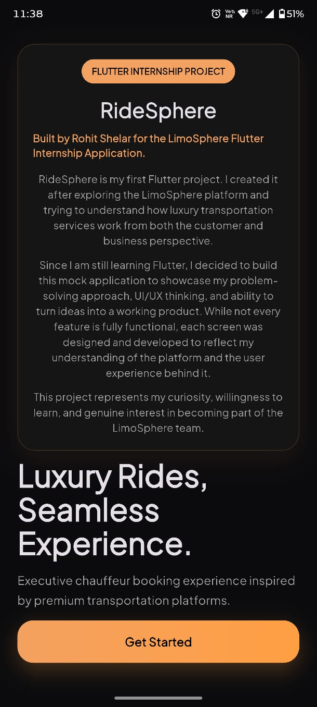
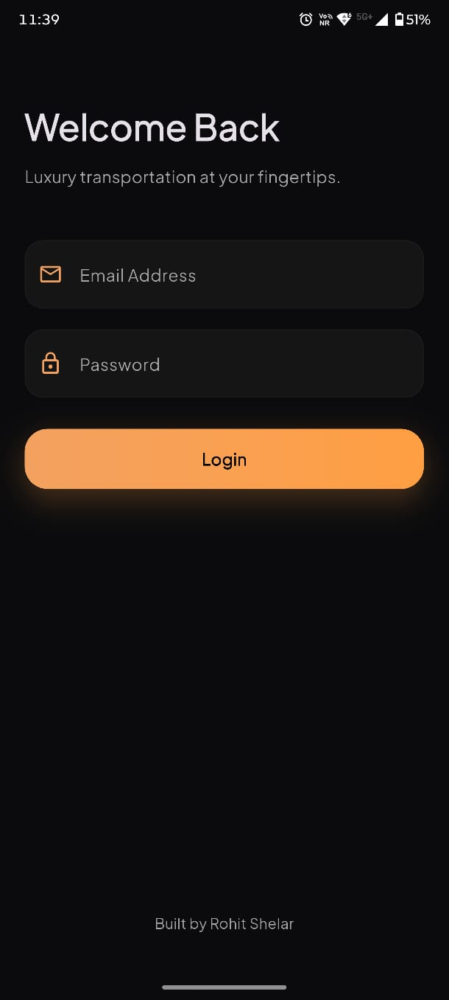
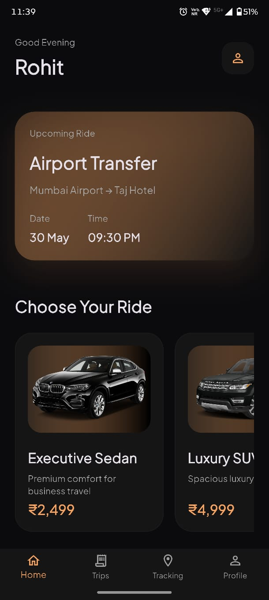
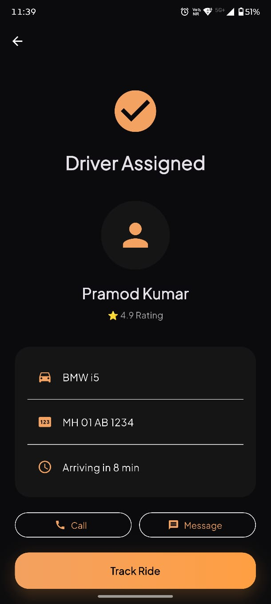
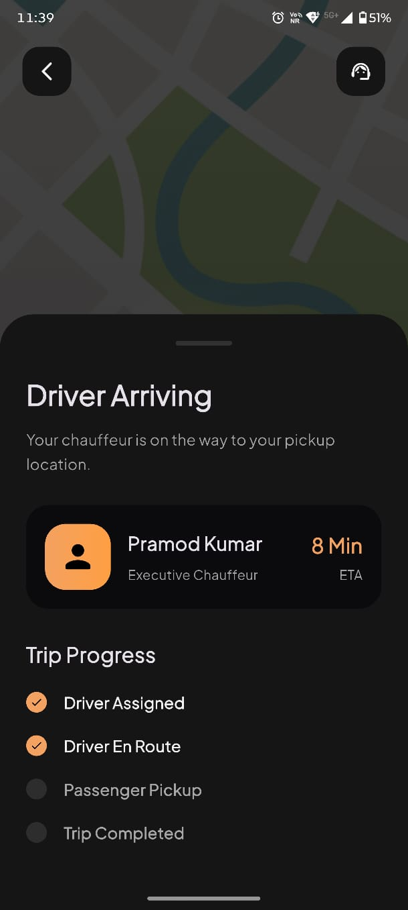

# RideSphere

A Flutter-based luxury chauffeur booking application inspired by the LimoSphere platform.

## About

RideSphere is my first Flutter project, created to demonstrate Flutter development skills, UI/UX understanding, and product thinking through a luxury transportation booking experience.

## Features

- Luxury vehicle selection
- Airport transfer booking
- Booking confirmation
- Driver assignment
- User profile
- Premium dark theme inspired by LimoSphere

## Screenshots

### Onboarding Screen

### Login Screen

### Home 1 Screen

### Home 2 Screen

### Booking 1 Screen

### Booking 2 Screen

### Booking Confirmation

### Driver Assignment

### Profile Screen

### Tracking Screen

## Tech Stack

- Flutter
- Dart
- Provider
- Material Design

## Author

**Rohit Shelar**