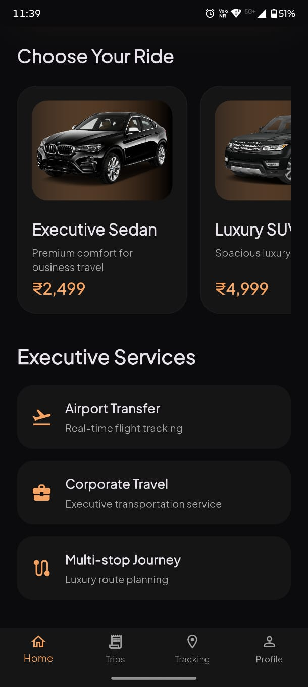
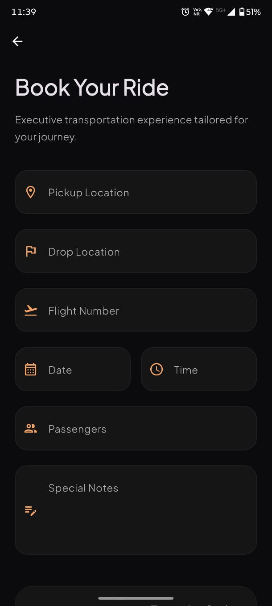
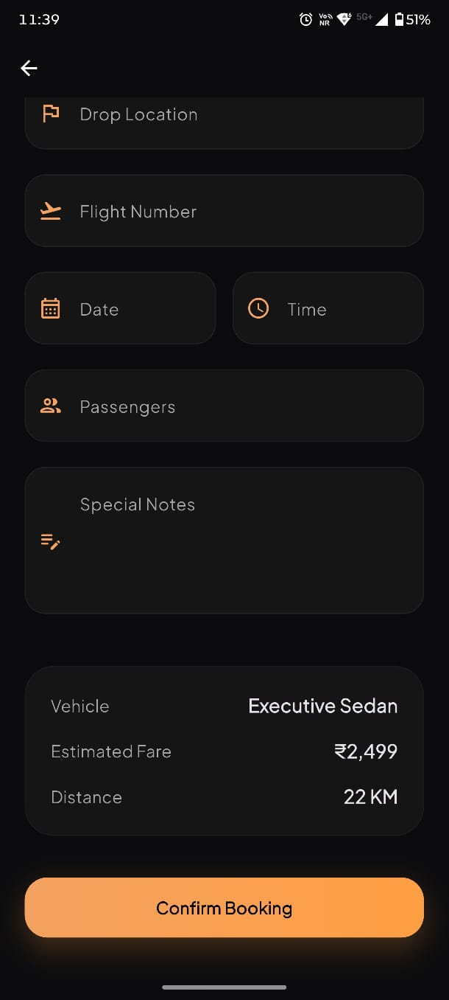
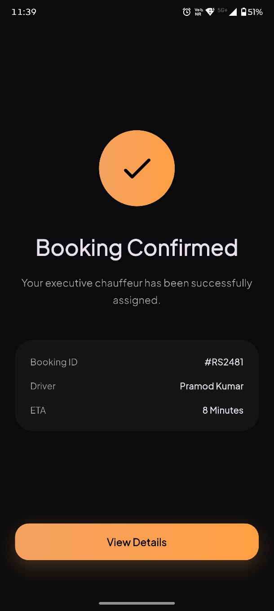
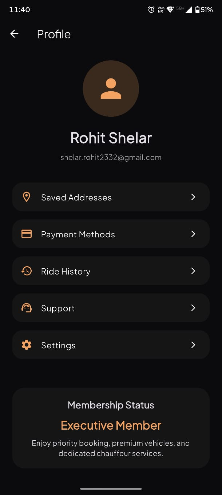

# RideSphere

A Flutter-based luxury chauffeur booking application inspired by the LimoSphere platform.

## About

RideSphere is my first Flutter project, created to demonstrate Flutter development skills, UI/UX understanding, and product thinking through a luxury transportation booking experience.

## Features

- Luxury vehicle booking experience
- Ride confirmation workflow
- Driver assignment screen
- User profile management
- Premium LimoSphere-inspired design
- Smooth Flutter navigation

## Screenshots

### Onboarding Screen

### Login Screen

### Home Screen 1

### Home Screen 2

### Booking Screen 1

### Booking Screen 2

### Booking Confirmation

### Driver Assignment

### Profile Screen

### Tracking Screen

## Tech Stack

- Flutter
- Dart
- Material Design

## Author

**Rohit Shelar**
